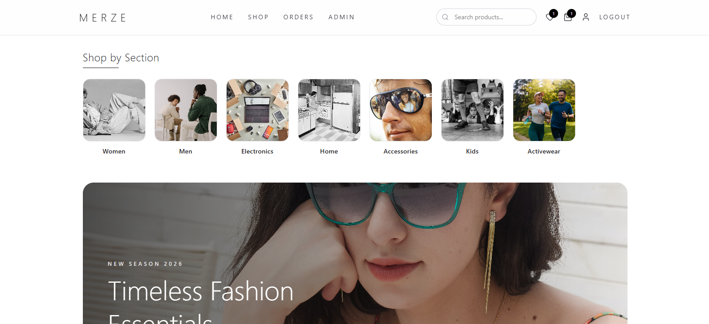
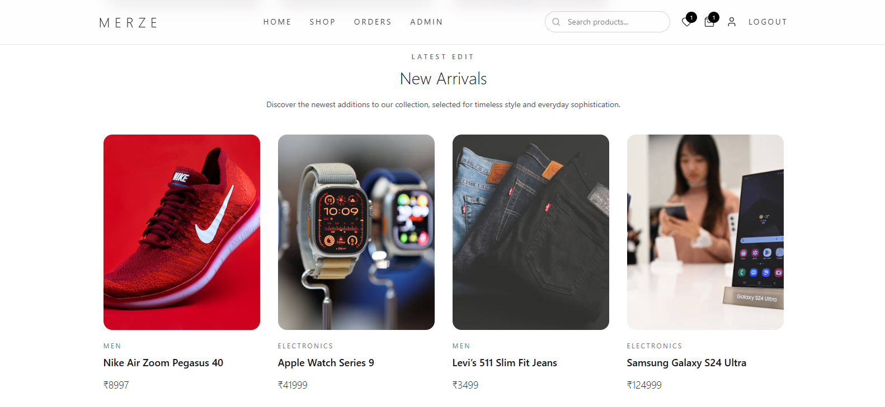
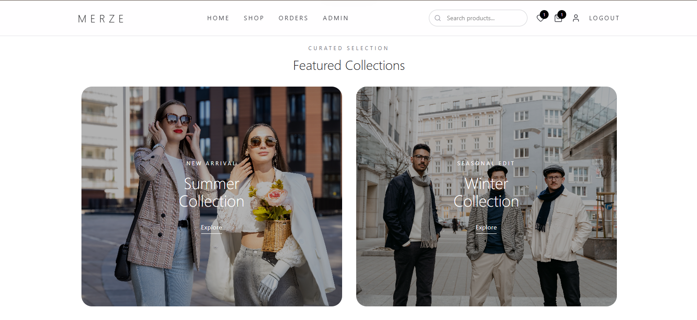
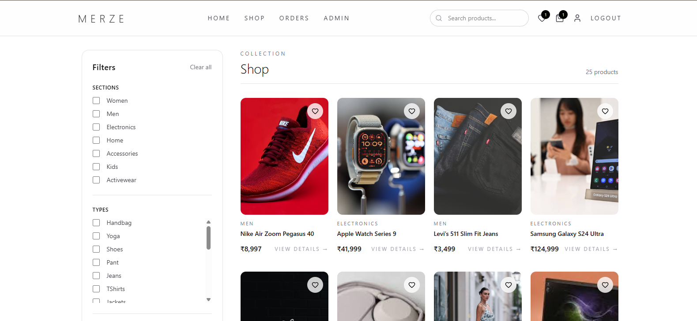
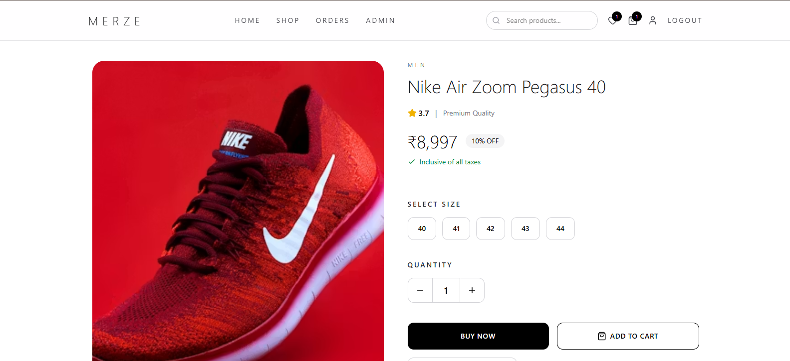
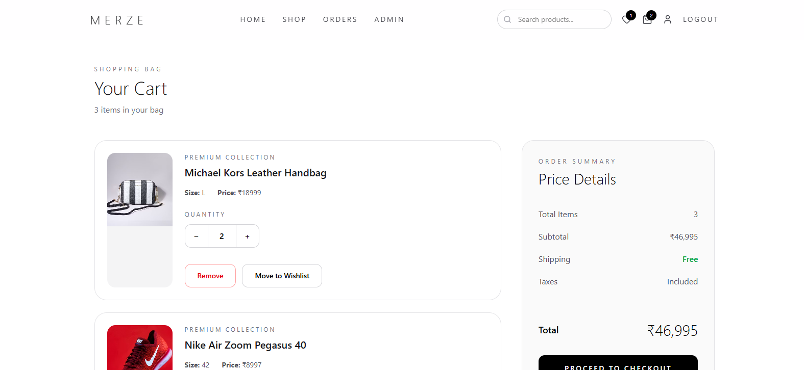
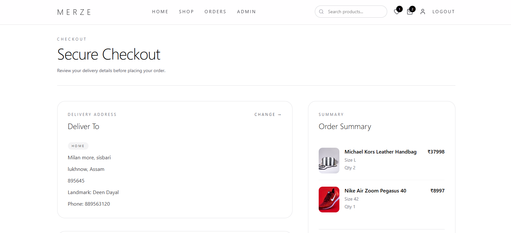
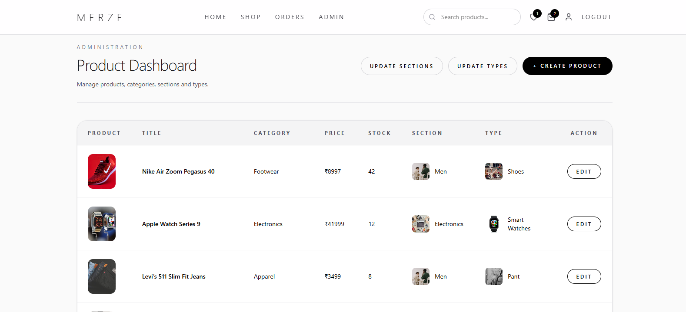
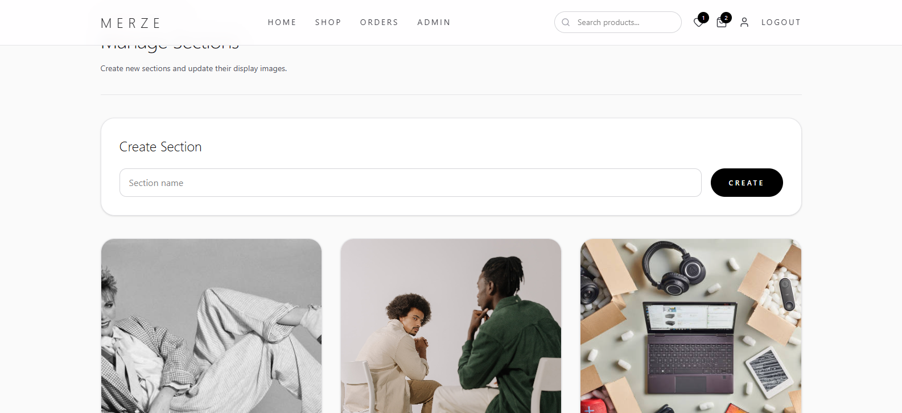

# 🛍️ Merze E-commerce Application

A modern full-stack e-commerce web application that allows users to
browse products, manage a shopping cart, wishlist, delivery addresses,
and place orders through a smooth and intuitive interface.

Built to demonstrate real-world frontend--backend integration, reusable
React components, responsive UI development, and RESTful API design.

Built with a **React** frontend, **Tailwind CSS v4**,
**Node.js/Express** backend, and **MongoDB** database.

------------------------------------------------------------------------


------------------------------------------------------------------------

## Technologies

### Frontend

-   React JS
-   React Router
-   Tailwind CSS v4
-   React Context API
-   React Toastify
-   Lucide React
-   JavaScript (ES6+)

### Backend

-   Node.js
-   Express
-   MongoDB
-   REST APIs

------------------------------------------------------------------------

## 🏗 Architecture

``` text
React Frontend
      │
React Context API
      │
REST API Requests
      │
Express.js
      │
MongoDB Atlas
```

------------------------------------------------------------------------

## 🌐 Demo

-   **Frontend:** https://merze.vercel.app
-   **Backend API:** https://my-ecommerce-eta-ruby.vercel.app
-   **Loom Walkthrough:**
    https://www.loom.com/share/25adf0ed43c242d1adc0fad96495302f

------------------------------------------------------------------------

## Authentication

This project was built before I learned authentication with JWT, Clerk,
or OAuth.

Users can register with an email address and log in using that same
email. The application does not implement secure authentication or
password hashing. The primary focus of this project was building a
complete e-commerce workflow, including product browsing, shopping cart
management, order placement, and RESTful API integration.

Secure authentication is listed as a future improvement.

------------------------------------------------------------------------

## ⚡ Quick Start

### 1. Clone and run the backend

``` bash
git clone https://github.com/Rakeshneopane/merze-ecommerce-backend.git
cd merze-ecommerce-backend
npm install
npm run dev
```

### 2. Clone and run the frontend

Open a second terminal:

``` bash
git clone https://github.com/Rakeshneopane/Merze.git
cd Merze
npm install
npm run dev
```

The frontend communicates with the backend running on
`http://localhost:4000`.

------------------------------------------------------------------------

## 🔐 Environment Setup

### Frontend

Create a `.env` file inside the frontend project:

``` env
VITE_BASE_URI=http://localhost:4000
```

For production:

``` env
VITE_BASE_URI=https://my-ecommerce-eta-ruby.vercel.app
```

### Backend

Create a `.env` file inside the backend project:

``` env
PORT=4000
NODE_ENV=development

MONGODB_URI=your_mongodb_connection_string
```

For production, replace the localhost URLs with your deployed backend
URL.

> **Note**
>
> -   Restart the development server after updating the `.env` file.
> -   Add `.env` to `.gitignore` to avoid committing sensitive
>     credentials.

------------------------------------------------------------------------

## ✨ Features

### Product Browsing

-   Displays a list of all products
-   Filters products by section and type
-   Displays detailed product information
-   Product image gallery
-   Related product recommendations

### Cart & Orders

-   Adds products to the shopping cart
-   Updates product quantity in the cart
-   Removes products from the cart
-   Wishlist management
-   Places orders with a selected delivery address (Cash on Delivery
    only for now)
-   Order history

### User Management

-   Registers new users
-   Allows users to log in using their email
-   Displays user profile and full order history
-   Adds, updates, and deletes delivery addresses

### Admin Features

-   Create, update, and delete products
-   Manage sections
-   Manage product types
-   Update section and type images

### UI & Architecture

-   Reusable React components
-   Client-side routing with React Router
-   Responsive Tailwind CSS v4 interface
-   Loading, empty, and error states
-   Toast notifications

------------------------------------------------------------------------

## API Reference

### Products

-   `GET /api/products` -- Fetch all products
-   `GET /api/products/:productId` -- Fetch product by ID
-   `POST /api/create-products` -- Create product (admin)
-   `POST /api/products/:productId` -- Update product
-   `DELETE /api/products/:productId` -- Delete product

### Sections & Types

-   `GET /sections` -- Fetch all sections
-   `POST /sections` -- Create section
-   `GET /types` -- Fetch all types
-   `POST /types` -- Create type

### Users

-   `POST /api/users` -- Create a user
-   `GET /api/users` -- Fetch all users
-   `GET /api/user/:id` -- Fetch user by ID
-   `DELETE /api/user/:id` -- Delete user

### Addresses

-   `POST /api/users/:id/addresses` -- Add address
-   `POST /api/users/:userId/addresses/:addressId` -- Update address
-   `DELETE /api/users/:userId/addresses/:addressId` -- Delete address

### Orders

-   `POST /api/orders` -- Place an order

### Authentication

-   `POST /api/auth/login` -- Login user via email

### Sample Response (`GET /api/products`)

``` json
{
  "data": [
    {
      "_id": "6904310714d0f05c914f6527",
      "title": "Nike Air Zoom Pegasus 40",
      "price": 11999,
      "category": "Footwear"
    }
  ]
}
```

------------------------------------------------------------------------

## 📷 Screenshots











------------------------------------------------------------------------

## 📚 What I Learned

-   React Context API
-   RESTful API integration
-   MongoDB data modeling
-   Responsive UI with Tailwind CSS
-   Full-stack application architecture
-   CRUD operations
-   Deployment using Vercel

------------------------------------------------------------------------

## Future Improvements

-   Secure JWT-based authentication with password hashing
-   Protected routes for authenticated users
-   Role-based authorization (Admin/User)
-   Payment gateway integration (Stripe / Razorpay)
-   Product search and sorting
-   Reviews and ratings
-   Admin analytics dashboard
-   Unit and integration testing

------------------------------------------------------------------------

## 📬 Contact

For bugs, feedback, or feature requests, feel free to reach out:

-   📧 Email: rakeshneopane@gmail.com
-   📧 Alternate Email: lucasneopane123@gmail.com
-   💼 LinkedIn: https://linkedin.com/in/rakesh-neopane
